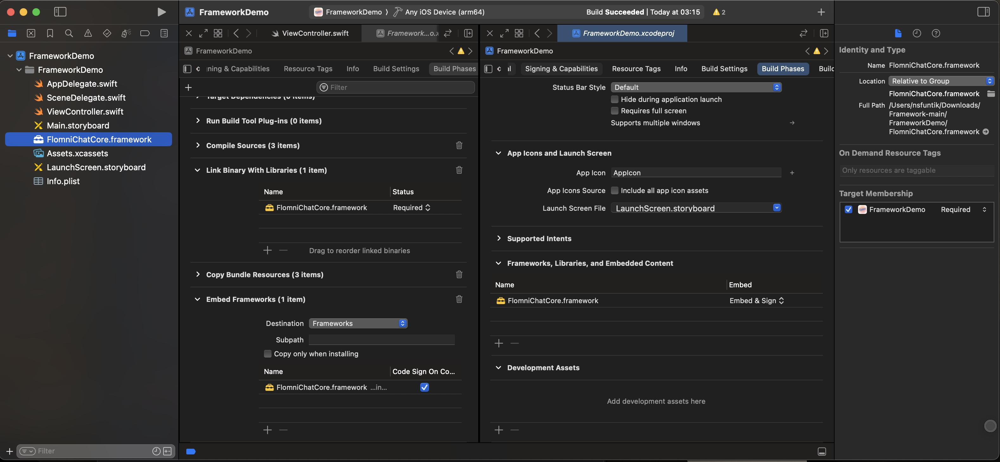
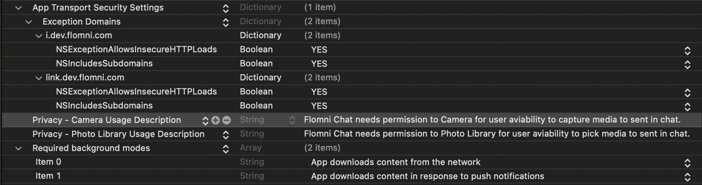

# `Flomni Chat Swift Package`

# Интеграция FlomniChat SDK в ваше iOS приложение

Этот гайд поможет вам интегрировать FlomniChat SDK в ваше iOS приложение.

## Шаг 1: Установка FlomniChat SDK

### Использование CocoaPods

Добавьте FlomniChat в ваш Podfile:

```ruby
pod 'FlomniChat'
```

Затем выполните команду:

```bash
pod install
```

### Использование Swift Package Manager

Добавьте FlomniChat в вашем Xcode проекте через `File > Swift Packages > Add Package Dependency...` и укажите URL репозитория FlomniChat:

```
https://gitlab.com/flomni-public/ios-sdk-demo-app.git
```

> **!!!** Убедитесь, что `FlomniChatCore.framework` добавлен во все таргеты вашего проекта. Это можно проверить в настройках таргетов в Xcode.



- Перетащите `FlomniChatCore.framework` в проект.
- Убедитесь, что `FlomniChatCore.framework` указан в разделе "Frameworks, Libraries, and Embedded Content" и установлен как `Embed & Sign`.

## Шаг 2: Настройка запуска вашего проекта

### Импорт необходимых модулей

Убедитесь, что вы импортировали все необходимые модули в вашем `AppDelegate`:

```swift
import FlomniChatCore
import SwiftUI
import UIKit
import UserNotifications
```

### Настройка AppDelegate

Создайте и настройте класс `AppDelegate`, который будет инициализировать FlomniChat и обрабатывать уведомления:

Создаем и настраиваем ``ChatClient``

#### **Параметры**:
- `apiKeyString`: Ключ компании. Этот ключ можно получить, зарегистрировавшись на [нашем сайте](https://my.stg.flomni.com/).
- `applicationGroupIdentifier`: Идентификатор группы приложений для локального хранилища.
- `userId`: Уникальный идентификатор пользователя.

```swift
@main
class AppDelegate: UIResponder, UIApplicationDelegate {
    var window: UIWindow?
    /// Экземпляр `FlomniChat`, предоставляемый `AppDelegate`
    var flomniChat: FlomniChat?

    func application(_ application: UIApplication, didFinishLaunchingWithOptions launchOptions: [UIApplication.LaunchOptionsKey: Any]?) -> Bool {
        let FLOMNI_API_KEY: String = ProcessInfo.processInfo.environment["FLOMNI_API_KEY"] ?? ""
        debugPrint(FLOMNI_API_KEY)
        
        /// Create and configure the `ChatClient`
        /// - Parameters:
        ///   - apiKeyString: The company key string.
        ///   This key can be obtained by registering on [our website](https://my.stg.flomni.com/\).
        ///   - applicationGroupIdentifier: The security application group ID to use for the local storage.
        ///   - userId: The unique user ID.
        ///   - deviceToken: The device token associated with the user.
        flomniChat = FlomniChat(
            apiKey: FLOMNI_API_KEY,
            applicationGroupIdentifier: "group.com.flomni.chat",
            userId: "UNIQUE_USER_ID"
        )

        /// Устанавливаем экземпляр `FlomniChat` как `FlomniChatProvider`
        FlomniChatProvider.defaultValue = flomniChat
        /// Регистрируем `AppDelegate` как `UNUserNotificationCenterDelegate`
        UNUserNotificationCenter.current().delegate = flomniChat?.notificationCenter
        return true
    }

    /// Сообщает делегату, что приложение успешно зарегистрировано в Apple Push Notification service (APNs).
    func application(_ application: UIApplication, 
        didRegisterForRemoteNotificationsWithDeviceToken deviceToken: Data) {

        /// Добавляем токен устройства в `FlomniChat`
        flomniChat?.didRegisterForRemoteNotifications(with: deviceToken)
    }

    /// Сообщает делегату, что приложение получило удаленное уведомление.
    func application(_ application: UIApplication, 
    didReceiveRemoteNotification userInfo: [AnyHashable: Any], 
    fetchCompletionHandler completionHandler: @escaping (UIBackgroundFetchResult) -> Void) {

        flomniChat?.didReceiveRemoteNotification(
        didReceiveRemoteNotification: userInfo, 
        fetchCompletionHandler: completionHandler)
    }
    
    /// Обработка ошибок
    func application(_ application: UIApplication, didFailToRegisterForRemoteNotificationsWithError error: Error) {
        debugPrint(error)
    }
}
```
## Шаг 3: Дополнительные настройки проекта

### Настройка `Info.plist`

- Добавьте домен `link.dev.flomni.com` и `i.dev.flomni.com` в **Target Properties** для корректной работы SDK с **API**:

```xml
    <key>NSExceptionDomains</key>
    <dict>
        <key>i.dev.flomni.com</key>
        <dict>
            <key>NSExceptionAllowsInsecureHTTPLoads</key>
            <true/>
            <key>NSIncludesSubdomains</key>
            <true/>
        </dict>
        <key>link.dev.flomni.com</key>
        <dict>
            <key>NSExceptionAllowsInsecureHTTPLoads</key>
            <true/>
            <key>NSIncludesSubdomains</key>
            <true/>
        </dict>
    </dict>
```

- Для работы функционала отправки медиа в чате следует добавить описание использования **Камеры** и **Photo Library**:
```xml
<key>NSCameraUsageDescription</key>
 <string> Flomni Chat needs permission to Camera for user aviability to capture media to sent in chat.
 </string>
<key>NSPhotoLibraryUsageDescription</key>
 <string> Flomni Chat needs permission to Photo Library for user aviability to pick media to sent in chat. 
 </string>

```

- Для корректной работы уведомлений - **Push Notifications**, добавьте:
```xml
<key>UIBackgroundModes</key>
<array>
   <string>fetch</string>
   <string>remote-notification</string>
</array>
```
#### Конечный вид Info.plist


### Настройка отображения модуля на `UIKit`

Создайте новый `UIHostingController`, который будет отображать интерфейс FlomniChat:

```swift
import FlomniChatCore
import SwiftUI
import UIKit

/// Инициализируем основной интерфейс `FlomniChat` списка каналов
/// - Параметры:
///   - theme : Предустановленная тема `FlomniChat`
///   - route: Маршрут `FlomniChat` для навигации к ChannelID, полученному из тела сообщения APNs Push Notification.
///   - placement: Расположение пользовательской панели инструментов, добавленной в верхнюю часть списка чатов в `ChatCorner`.
/// - content: Пользовательский контент, отображаемый в панели навигации модуля чата.
class ChatViewController: UIHostingController<FlomniContentView<Image>> {
    required init?(coder aDecoder: NSCoder) {
        super.init(coder: aDecoder, rootView: FlomniContentView<Image>(
            theme: .default,
            route: [],
            placement: .automatic,
            content: { Image(systemName: "heart.fill") })
        )
    }
}
```
### Настройка отображения модуля на `SwiftUI`
- Укажите `UIApplicationDelegateAdaptor` в структуре типа `App` вашего приложения 
```swift
@main
struct DemoApp: App {
    @UIApplicationDelegateAdaptor(AppDelegate.self) var delegate
    var body: some Scene {
        WindowGroup {
            CommonContentView()
        }
    }
}
```

Экран-пример доступных для использования интерфейсов: 
- сам модуль чата – `FlomniContentView` 
- отображение логов модуля – `TerminalTab`
- и настройка и тестирование локальных пуш-уведомлений – `NotificationsList`.
```swift

struct CommonContentView: View {
    
  /// An enum representing different tabs.
  enum Tab: Int {
        case terminal
        case chat
        case notifications
  }
    
  /// Access the FlomniChat environment object.
  @Environment(\.flomniChat) var flomniChat
    
  /// The currently selected tab.
  @State private var selectedTab = Tab.chat
    
  var body: some View {
      TabView(selection: $selectedTab) {

          /// TerminalTab is a view that displays the logs during the session.
          TerminalTab()
             .tag(Tab.terminal)
             .tabItem { Label("Terminal", systemImage: "terminal") }


          /// FlomniContentView is a view that displays channels list.
          FlomniContentView(
                theme: flomniChat?.theme ?? .default,
                route: [],
                placement: ToolbarItemPlacement.automatic,
                content: { YOUR_CONTENT_IMPLEMENTATION })
	    .tag(Tab.chat)
            .tabItem { Label("Chats", systemImage: "bubble.left.and.bubble.right") }
            

        /// NotificationsList is a view that displays local notifications list & editor.
        NotificationsList(userNotificationCenter: UNUserNotificationCenter.current())
         .tag(Tab.notifications)
	     .tabItem { Label("Notifications", systemImage: "bell") }
             
            
        }
    }
}
```


### Шаг 4: Тестирование

1. **Запустите приложение** и убедитесь, что оно успешно инициализирует `FlomniChat`.
2. **Проверьте регистрацию для уведомлений**, отправив тестовое push-уведомление и проверив, что оно обрабатывается правильно.

Теперь ваше приложение интегрировано с FlomniChat и готово для обработки сообщений и уведомлений через FlomniChat SDK. 
# FlomniChatCore
